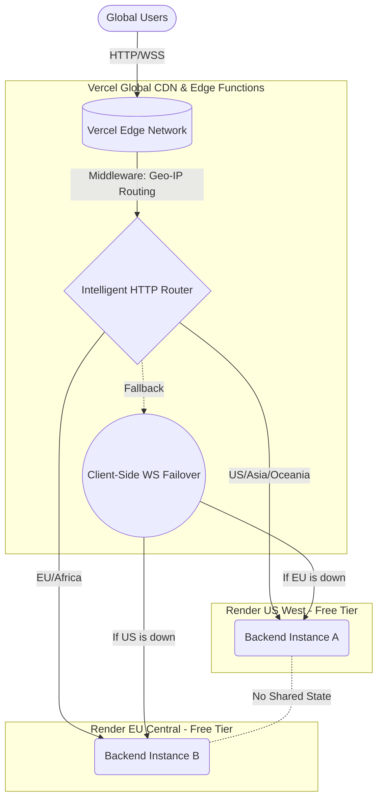

# Super Directive: Render + Vercel Full-Stack Zero-Cost High Availability & Load Balancing Architecture (Poor but Professional Edition)

## 1. Architecture Design Principles & Overview
Utilizing the free tiers of Vercel and Render, we are implementing a cross-continent high-availability full-stack application. The frontend is deployed on Vercel's global CDN, while the backend utilizes the Render free tier to deploy two stateless instances in the US West (Oregon) and EU Central (Frankfurt). Intelligent geographic routing and failover are achieved via Vercel Edge Middleware and client-side failover logic.



## 2. Implementation Plan

### 2.1 Render Multi-Region Backend Deployment (`render.yaml`)
Use `render.yaml` to uniformly define both instances. Note that free instances have no availability guarantees and suffer from cold-start delays.

```yaml
services:
  # US Instance (Primary for Americas & Asia)
  - type: web
    name: ddos-backend-us
    region: oregon 
    runtime: docker
    rootDir: backend
    dockerfilePath: ./Dockerfile
    plan: free
    envVars:
      - key: REGION
        value: US_WEST

  # EU Instance (Primary for Europe & Africa)
  - type: web
    name: ddos-backend-eu
    region: frankfurt
    runtime: docker
    rootDir: backend
    dockerfilePath: ./Dockerfile
    plan: free
    envVars:
      - key: REGION
        value: EU_CENTRAL
```
**Deployment Steps:**
Connect your GitHub repository in the Render Dashboard, select this `render.yaml`, and Render will automatically provision both services. After deployment, obtain their respective URLs (e.g., `https://ddos-backend-us.onrender.com`).

### 2.2 Vercel Intelligent Geographic Routing (Edge Middleware)
Create `middleware.js` in the root of the Vercel frontend project. This script executes at the Vercel CDN edge node closest to the user, selects the corresponding Render instance based on the GeoIP info in the request headers, and rewrites the URL.

*(Note: The code for this is already implemented in `frontend/middleware.js`)*

### 2.3 The Ultimate Solution for WebSocket Disconnects & Failover (Client-Side)
Because Vercel Serverless Functions/Edge Network will terminate connections after the request completes, **they cannot be used to proxy persistent WebSocket connections**. Our application relies heavily on WebSockets, so load balancing and failover logic must reside on the **client side (React Hook)**.

We provide a smart multi-attempt mechanism on the frontend.

*(Note: The code for this is already implemented in `frontend/src/hooks/useWebSocket.js`)*

### 2.4 Render Cold Starts & Keep-Alive Strategy
The Render Free tier automatically sleeps after 15 minutes of inactivity. If both instances sleep, the first wake-up takes 30-50 seconds.

**Zero-Cost Keep-Alive Approach:**
Use a GitHub Actions Cron job to ping the HTTP `/api/status` endpoint of both servers every 14 minutes.

```yaml
# .github/workflows/keep-alive.yml
name: Keep Render Backends Alive
on:
  schedule:
    # Triggers every 14 minutes in UTC
    - cron: '*/14 * * * *'
  workflow_dispatch:

jobs:
  ping:
    runs-on: ubuntu-latest
    steps:
      - name: Ping US Backend
        run: curl -s https://ddos-backend-us.onrender.com/api/status > /dev/null
      - name: Ping EU Backend
        run: curl -s https://ddos-backend-eu.onrender.com/api/status > /dev/null
```
**CRITICAL LIMITATION:**
Every Render Web Service account has a total free pool of 750 shared hours per month.
If you run two instances 24/7 without sleeping: 2 instances * 24 hours * 31 days = 1488 hours.
Since an account without a credit card only has **750** hours total, **you cannot keep both instances awake 24/7! They will exhaust the quota mid-month and be shut down.**

**The Best 'Poor-Mans' Compromise:**
Do not use a keep-alive script. Accept the hibernation. Have the frontend display a beautiful loading animation stating "Spinning up core engines (Expected time: 45s)" to mask the backend cold start. This is the ultimate expression of "Poor but Professional."

## 3. Cost Analysis & Squeezing the Limits
| Resource | Service Used | Pricing Model | Estimated Monthly Budget |
|---|---|---|---|
| Frontend Static + CDN | Vercel Free Tier | 100GB Bandwidth, unlimited requests | **$0** |
| Edge Compute/Routing | Vercel Edge Middleware | Included in free tier (1m req/mo) | **$0** |
| Backend Instance US | Render Web (Free) | 750 shared hours/mo (Clock stops on sleep) | **$0** |
| Backend Instance EU | Render Web (Free) | 750 shared hours/mo (Clock stops on sleep) | **$0** |
| DNS / DOMAIN | Vercel built-in *.vercel.app | Built-in domain, no purchase needed | **$0** |
| Load Balancing | Vercel Next.js / Client Polling | Local networking logic, no paid LB | **$0** |
| **Total** | | | **$0 / Month** |

## 4. Failover Playbook 
If the application becomes unresponsive, execute the following steps:
1. **Confirm Frontend Connectivity:** Open browser Console to see if the Vercel site returns HTTP 200, and observe JS errors.
2. **Confirm Backend WS Status:** Observe the `useWebSocket` hook to see which `wss://` node it is attempting to connect to. Check if it is alternating between 502/504 errors on both nodes.
3. **Investigate Cold Starts:** Check if the Render console `Logs` page is outputting `Starting service...`. If so, wait 1 minute.
4. **Monthly Quota Exhaustion:** If it says "Free usage limit exceeded," it means you used over 750 hours this month. This proves your app is popular! At this point, you can create a new GitHub + Render account to continue the free ride (extreme poverty measure), or use your only credit card to pay $7 for an upgrade.�发一次
    - cron: '*/14 * * * *'
  workflow_dispatch:

jobs:
  ping:
    runs-on: ubuntu-latest
    steps:
      - name: Ping US Backend
        run: curl -s https://ddos-backend-us.onrender.com/api/status > /dev/null
      - name: Ping EU Backend
        run: curl -s https://ddos-backend-eu.onrender.com/api/status > /dev/null
```
**注意限制：**
每个 Render Web Service 每月有 750 小时的免费额度。
如果你全天候 24x7 跑两个实例（无休眠），2个实例 * 24小时 * 31天 = 1488 小时。
由于一个账户（无绑卡）的免费额度总计是 `750` 小时，**你不能保持两个实例同时 24/7 唤醒！会在月中耗尽额度停机**。

**最佳穷人妥协：**
不要做保活。接受休眠。让前台展示“正在启动核心引擎 (预计需 45 秒)” 的精美加载动画（掩盖后端冷启动的事实），这是“贫穷但专业”的最佳体现。

## 3. 成本分析与压榨极限
| 资源项 | 使用服务 | 定价策略 | 月度预算预估 |
|---|---|---|---|
| 前端静态托管+CDN | Vercel Free Tier | 每月 100GB 带宽，无限请求 | **$0** |
| 边缘计算/路由 | Vercel Edge Middleware | 包含在免费额度中 (1m 次请求/月) | **$0** |
| 后端实例 US | Render Web (Free) | 每月 750小时共享 (休眠停表) | **$0** |
| 后端实例 EU | Render Web (Free) | 每月 750小时共享 (休眠停表) | **$0** |
| DNS / DOMAIN | Vercel 内置的 *.vercel.app | 内置域名无需购买 | **$0** |
| 负载均衡 LB | Vercel Next.js / 客户端轮询 | 本地方案无需付费 LB 服务 | **$0** |
| **总计** | | | **$0 / 月** |

## 4. 故障演练手册 (Playbook)
如果发现应用无响应，执行以下步骤：
1. **确认前端连通性：** 打开浏览器 Console 查看 Vercel 站点是否 200，观察有无 JS 报错。
2. **确认后端 WS 状态：** 观察 `useWebSocket` hook 尝试的 `wss://` 连接是哪个节点，是不是两个节点在来回 502/504。
3. **查探冷启动：** Render 控制台中 `Logs` 页面是否正在输出 `Starting service...`。如果是，耐心等待一分钟即可。
4. **月度额度耗尽规避：** 若提示 "Free usage limit exceeded"，意味着你本月使用了超过750小时。这证明你的应用很火！此时你可以创建一个新 GitHub 账号+Render账户，换个域名继续白嫖（极度贫穷做法），或掏出名下唯一一张信用卡的 $7 升级。
